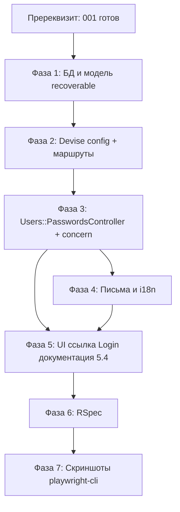

# Implementation Plan: Система сброса пароля

**Spec:** `.memory-bank/features/002-forgot-password/spec.md` (v1.2)  
**Статус:** Reviewed (Inertia-имена, порядок docs, скелет i18n; URL для ссылки «Забыли пароль?» — только из props Rails, без JS-библиотек маршрутов)  
**Зависимость:** `.memory-bank/features/001-auth-email/` — реализация и инфраструктура из плана 001 должны быть выполнены до или параллельно с фазами ниже.

---

## 1. Grounding: текущий код vs спека

| Ожидание спеки | Факт в репозитории |
| :--- | :--- |
| Devise, `:confirmable`, Inertia-auth из 001 | В `video_chat_and_translator/Gemfile` **нет** `devise`, `sidekiq`, `rspec-rails`; `config/routes.rb` **без** `devise_for` |
| Модель `User`, `db/schema.rb` | Файла `app/models/user.rb` и **`db/schema.rb` в дереве нет** (как зафиксировано в плане 001) |
| Страницы `auth/Login`, паттерн i18n → props | Есть только `app/frontend/pages/Landing.tsx`, `inertia_example/` — **страниц логина в коде пока нет** (появятся по 001) |
| Sidekiq + `deliver_later` для писем | Не подключено до выполнения фазы 0 плана 001 |

**Вывод:** 002 **не** стартует с «добавить только recoverable» — сначала должен существовать минимальный каркас 001 (User, маршруты, Inertia Login/Register, очередь, `ru.yml`, тестовый стек). План ниже предполагает, что при старте работ по 002 эти артефакты уже есть; шаги 002 не дублируют фазы 0–2 плана 001, а ссылаются на них.

**Конфликты с архитектурой проекта и разрешения:**

| Правило | Как соблюсти в 002 |
| :--- | :--- |
| Только CRUD в «стандартных» контроллерах | Использовать **`Users::PasswordsController < Devise::PasswordsController`** с действиями `new`, `create`, `edit`, `update` — это штатные действия Devise для ресурса пароля, без произвольных кастомных action |
| Кастомная логика (например, только подтверждённые + anti-enumeration) | Реализовать **внутри** переопределений `create` / при необходимости `update` и приватных методов того же контроллера или через **concern** в `app/controllers/concerns/`, если файл разрастается |
| Сервис-объекты только для внешних API | Логика «найти пользователя, проверить `confirmed?`, поставить письмо в очередь» остаётся в контроллере/concern; отдельный PORO не вводить без необходимости |
| Миграции — только с согласования | Шаг с колонками **recoverable** явно помечен **gate**; без явного ОК от владельца репозитория миграцию не генерировать |
| Документация в `/docs` | После появления кастомного контроллера/потока — короткий файл в `video_chat_and_translator/docs/` (например `docs/features/password-reset.md`): маршруты, политика anti-enumeration, зависимость от `confirmed_at` |

---

## 2. Зависимости между фазами (граф)



**Критический путь:** пререквизит 001 → миграция + модель → маршруты → контроллер → (письма и i18n параллельно с контроллером; фронт после контракта props) → **документация `docs/` после фронта (Step 5.4)** → тесты → скриншоты.

---

## 3. Фазы и атомарные шаги

Каждый шаг можно проверить отдельно: либо тестом, либо ручной проверкой в dev (по соглашению с владельцем — запуск сервера и запросов выполняет разработчик в devcontainer).

---

### Пререквизит P0 — Завершение каркаса 001

**Цель:** На момент начала 002 в проекте уже есть то, от чего явно зависит спека 002.

**Чеклист (сверка с планом 001):**

1. `User` с `devise :database_authenticatable, :registerable, :confirmable, :validatable` и миграция `users`.
2. `devise_for :users` с контроллерами sessions / registrations / confirmations; страница входа рендерит Inertia `auth/Login` (или финальное имя из 001).
3. `config.i18n.default_locale = :ru`, переводы авторизации в `config/locales` (например `ru.yml`).
4. Active Job → Sidekiq, письма Devise через цепочку, где доставка уходит в очередь (`deliver_later` / эквивалент из 001).
5. `spec/` + FactoryBot, фабрика `:user` с трейтами `:confirmed` / `:unconfirmed`.

**Файлы-ориентиры из 001:**  
`video_chat_and_translator/config/routes.rb`, `app/models/user.rb`, `app/controllers/users/sessions_controller.rb`, `app/controllers/users/registrations_controller.rb`, `config/locales/*.yml`, `config/initializers/devise.rb`, `config/application.rb`, `spec/factories/users.rb`.

**Проверка:** `bundle exec rspec` по тестам 001 зелёный; вручную — вход подтверждённого пользователя возможен.

---

### Фаза 1 — База данных и модель `:recoverable`

#### Step 1.1 — Gate: согласовать миграцию с владельцем

**Действие:** Запросить разрешение на миграцию. До ОК — не генерировать файлы в `db/migrate/`.

#### Step 1.2 — Миграция полей Devise Recoverable

**Условие:** поля `reset_password_token`, `reset_password_sent_at` **отсутствуют** в `db/schema.rb` после 001.

**Файл (создать после gate):** `video_chat_and_translator/db/migrate/XXXXXXXX_add_recoverable_to_users.rb`

**Содержание:** добавить `reset_password_token` (string, индекс unique), `reset_password_sent_at` (datetime) по документации Devise для `:recoverable`.

**Проверка:** миграция применяется; в `schema.rb` появились колонки; индекс на токен уникален.

#### Step 1.3 — Подключить `:recoverable` в `User`

**Файл:** `video_chat_and_translator/app/models/user.rb`

**Действие:** Добавить `:recoverable` в список `devise ..., :recoverable` (порядок обычно не критичен; оставить совместимость с `:confirmable`).

**Проверка:** в консоли (когда разрешено окружением) у подтверждённого пользователя вызов `send_reset_password_instructions` не падает и заполняет токен; после успешного сброса токен сбрасывается (поведение Devise).

---

### Фаза 2 — Конфигурация Devise и маршруты

#### Step 2.1 — Срок жизни токена сброса

**Файл:** `video_chat_and_translator/config/initializers/devise.rb`

**Действие:** Задать `config.reset_password_within` (согласовать с продуктом; разумный дефолт Devise — например 6 часов; зафиксировать в комментарии к миграции/docs при отличии от дефолта).

**Проверка:** значение читается в runtime (`Devise.reset_password_within`).

#### Step 2.2 — Подключить контроллер паролей в `routes`

**Файл:** `video_chat_and_translator/config/routes.rb`

**Действие:** В блок `devise_for :users, controllers: { ... }` добавить **`passwords: "users/passwords"`** (имя файла/класса должно совпадать с PSR проекта).

**Проверка:** **обязательно** сверить имена хелперов с актуальным `routes.rb` (по соглашению — не гадать path). После изменений ожидаются стандартные Devise-пути вроде `new_user_password_path`, `edit_user_password_path` (точные имена — вывод `bin/rails routes | grep password` у разработчика).

**Затронутые файлы:** только `config/routes.rb` на этом шаге.

---

### Фаза 3 — Серверная логика сброса

#### Step 3.1 — Concern (опционально): политика запроса сброса

**Файл (создать при необходимости):** `video_chat_and_translator/app/controllers/concerns/password_reset_request_handler.rb`

**Ответственность:** Инкапсулировать чистую логику:

- нормализация email из params;
- валидация формата (через временный `User` или `Devise.email_regexp`);
- если формат невалиден → вернуть структуру ошибок для Inertia (**без** anti-enumeration «успеха»);
- если формат валиден → найти пользователя; **если** `user&.confirmed?` → вызвать `user.send_reset_password_instructions` (или эквивалент, совместимый с async-почтой из 001);
- в любом случае после валидного формата → один и тот же исход для UI (redirect + один и тот же ключ flash/notice).

**Проверка:** юнит-тесты concern изолированно **или** покрытие через request-спеки в фазе 6.

> Если логика умещается в &lt; ~25 строк, concern можно не вводить и оставить приватные методы в контроллере.

#### Step 3.2 — `Users::PasswordsController`

**Файл (создать):** `video_chat_and_translator/app/controllers/users/passwords_controller.rb`

**Соглашение по именам Inertia-компонентов:** путь относительно `app/frontend/pages/` — **`auth/ForgotPassword`** и **`auth/ResetPassword`** (файлы `auth/ForgotPassword.tsx`, `auth/ResetPassword.tsx`). Во всех `render inertia:` использовать **именно эти строки**, без префикса `Pages/` и без PascalCase в пути.

**Действие:**

1. **`new`** — `render inertia: "auth/ForgotPassword", props: { translations: I18n.t("auth.passwords.forgot") }` (или согласованный корневой ключ из Step 4.2; без русского в TSX).
2. **`create`** — политика спеки §1 и §6: при **невалидном формате email** — `render inertia: "auth/ForgotPassword", props: { translations: ..., errors: ... }`; при валидном формате — **одинаковый** успешный ответ (redirect + один и тот же flash); письмо в очередь только если пользователь существует и `confirmed?`.
3. **`edit`** — по `reset_password_token` из query:
   - при **невалидном/просроченном** токене — `render inertia: "auth/ResetPassword", props: { translations: I18n.t("auth.passwords.reset"), token_state: "invalid" }` (или эквивалентные флаги; значения **JSON-сериализуемы**, без Symbol в props);
   - при **валидном** токене — `render inertia: "auth/ResetPassword", props: { translations: ..., reset_password_token: ..., token_state: "valid" }` (токен передавать только в объёме, нужном форме, обычно как скрытое поле из query params).
4. **`update`** — смена пароля через логику Devise; при **ошибках валидации** — `render inertia: "auth/ResetPassword", props: { translations: ..., errors: ..., reset_password_token: ... }` (паттерн как у `Users::RegistrationsController#create` в плане 001); при успехе — редирект на **страницу входа** с flash (текст через i18n, см. `devise.passwords.updated` или кастомный ключ в Step 4.2).
5. Переопределить **`after_resetting_password_path_for`** в этом контроллере (или через хук Devise), чтобы путь вёл на `new_user_session_path` (или актуальный path из `routes.rb` после проверки).

**Совместимость с Inertia:** все ответы с формой — только перечисленные компоненты `auth/ForgotPassword` / `auth/ResetPassword`.

**Затронутые файлы:** `app/controllers/users/passwords_controller.rb`; опционально concern из 3.1.

**Проверка:** request-спеки (фаза 6); ручной сценарий подтверждённого пользователя — письмо в очереди; несуществующий / неподтверждённый — нет enqueue, тот же flash что у «успеха».

---

### Фаза 4 — Письма и локализация

#### Step 4.1 — Шаблоны письма сброса

**Файлы (создать или переопределить):**  
`video_chat_and_translator/app/views/devise/mailer/reset_password_instructions.html.erb`  
(и при необходимости `reset_password_instructions.text.erb`)

**Действие:** Тексты через `I18n` в шаблоне или через стандартные ключи `devise.mailer.reset_password_instructions.*` в `config/locales/ru.yml` — **без** захардкоженного русского в ERB, если проект так договорён для 001.

**Проверка:** в development письмо открывается через **letter_opener_web** как в 001; тело содержит рабочую ссылку с `reset_password_token`.

#### Step 4.2 — Ключи i18n для всего потока сброса

**Файл:** `video_chat_and_translator/config/locales/ru.yml` (и при необходимости отдельный `config/locales/devise.ru.yml`, если так принято в 001)

**Действие:** Заполнить реальными русскими строками узлы ниже. Разделение: **`devise.*`** — то, что читает Devise и шаблоны `devise/mailer` (нельзя выдумывать произвольные плоские ключи вместо ожидаемых Devise); **`auth.passwords.*`** — то, что передаётся в Inertia как `translations` (кастомный поток 002, anti-enumeration, подписи полей кнопок).

**Скелет иерархии (пути ключей):**

```yaml
# Пример структуры — имена вложенных ключей подправить под фактические вызовы I18n.t в коде и ERB.
ru:
  devise:
    passwords:
      # Flash / сообщения после update (Devise); переопределить под текст спеки A2 при необходимости
      updated: "Пароль успешно изменён. Войдите с новым паролем."
      # send_paranoid_instructions — может использоваться при paranoid-режиме; при кастомном create проверить, не нужен ли ключ
      send_paranoid_instructions: "..."
    mailer:
      reset_password_instructions:
        subject: "..."
        greeting: "..."
        instruction: "..."
        action: "..."
        # Devise подставляет @resource, @token; в шаблоне вызывать I18n.t с нужным scope

  auth:
    passwords:
      forgot:
        title: "..."
        email_label: "..."
        submit: "..."
        # Сообщение после create при валидном email (anti-enumeration) — одно и то же во всех ветках
        request_accepted: "..."
        invalid_email: "..." # серверное дублирование сообщения клиента, если нужно
        network_error: "..." # паритет с Login из 001, если есть
      reset:
        title: "..."
        password_label: "..."
        password_confirmation_label: "..."
        submit: "..."
        token_invalid: "..." # просроченный / битый токен
        request_again_hint: "..." # ссылка/текст «запросить сброс снова»
```

**Проверка:** в коде контроллера и React использовать только ключи из согласованного дерева; пройтись по UI — нет «сырых» ключей; в TSX нет литералов на русском/английском для пользовательского текста.

---

### Фаза 5 — Frontend (Inertia + React)

**Перед правками:** сверить с существующими страницами 001: `app/frontend/pages/auth/*`, общий layout (`AuthLayout` или аналог из плана 001), подход к формам и Tailwind (`rounded-md`, центрирование).

#### Step 5.1 — Страница «Забыли пароль?»

**Файл (создать):** `video_chat_and_translator/app/frontend/pages/auth/ForgotPassword.tsx` — компонент **должен** соответствовать `render inertia: "auth/ForgotPassword"` (Step 3.2).

**Действие:**

- Поле email, отправка через Inertia form / router (как на Login/Register в 001).
- Клиентская валидация email **как на регистрации** (красная рамка + текст под полем).
- После успешного submit — одно нейтральное сообщение из props/flash (спека C1).
- Состояние загрузки кнопки по аналогии со входом.

**Проверка:** визуально и скриншот (фаза 7).

#### Step 5.2 — Страница «Новый пароль»

**Файл (создать):** `video_chat_and_translator/app/frontend/pages/auth/ResetPassword.tsx` — компонент **должен** соответствовать `render inertia: "auth/ResetPassword"` (Step 3.2).

**Действие:** Поля пароль / подтверждение; ошибки валидации у полей; истёкший токен — отдельное состояние; кнопка submit с блокировкой и спиннером (C2).

**Проверка:** полный сценарий с валидным токеном; негативные кейсы в RSpec + скриншоты.

#### Step 5.3 — Ссылка со страницы входа

**Файл:** страница логина из 001, например `app/frontend/pages/auth/Login.tsx`

**Стратегия URL (единственная для стека Rails + Inertia в этом проекте):** не использовать во фронте сторонние пакеты генерации URL по имени маршрута. Передавать **`forgot_password_url`** (или вложенный ключ вроде `paths.forgot_password`) из **`Users::SessionsController#new`** в props вместе с `translations`, вычисляя на сервере, например `forgot_password_url: new_user_password_path` (точное имя хелпера — только после проверки `routes.rb` / `bin/rails routes`). В `Login.tsx` — `<Link href={forgot_password_url}>` или `<a href={...}>`, **без** литерала пути в TSX.

**Действие:** Ссылка «Забыли пароль?»; текст подписи — из i18n (`auth.login` или `auth.passwords`).

**Проверка:** клик ведёт на форму forgot password (`new` для passwords); путь не захардкожен во фронте.

**Затронутые файлы:** `Login.tsx`, `app/controllers/users/sessions_controller.rb` (обязательные props с URL).

#### Step 5.4 — Документация фичи (после фронта)

**Когда:** после Step 5.1–5.3 (и желательно после стабилизации props/ключей i18n), чтобы в `docs/` попали финальные имена компонентов, URL-стратегия и полный список файлов.

**Файл (создать):** `video_chat_and_translator/docs/features/password-reset.md` (или согласованное имя)

**Содержание:** end-to-end поток; политика anti-enumeration; зависимость от `confirmed_at`; имена Inertia-компонентов `auth/ForgotPassword`, `auth/ResetPassword`; маршруты и хелперы (по факту `routes.rb`); перечень затронутых файлов; как ставится письмо в очередь (ссылка на подход 001).

**Проверка:** документ позволяет новому разработчику/агенту воспроизвести поток без чтения всего плана.

---

### Фаза 6 — Интеграционные тесты (RSpec)

**Файлы (создать или дополнить):** например  
`video_chat_and_translator/spec/requests/users/passwords_spec.rb`  
(структура `spec/requests/` как в плане 001).

**Сценарии (минимум):**

| # | Сценарий | Ожидание |
| :--- | :--- | :--- |
| 1 | POST запрос сброса для **подтверждённого** пользователя | `have_enqueued_mail` / `have_enqueued_job` (как принято в 001 после настройки доставки) |
| 2 | POST для **неподтверждённого** с тем же валидным email | Нет enqueue reset-письма; **тот же** HTTP/flash-поведение, что в сценарии «успех» (anti-enumeration) |
| 3 | POST для несуществующего email | Аналогично п.2 |
| 4 | POST с невалидным форматом email | Ошибка валидации, письмо не ставится в очередь |
| 5 | PATCH/PUT `update` с валидным токеном и валидным паролем | Пароль меняется; редирект на sign in; нужный flash |
| 6 | `update` с коротким паролем / несовпадением | Ошибки, пароль не меняется |
| 7 | `edit` / `update` с просроченным или битым токеном | Сообщение из спеки; без успешного сброса |

**Проверка:** `bundle exec rspec` — все зелёные.

---

### Фаза 7 — Доказательства (playwright-cli)

**Каталог:** `screenshots/002-forgot-password/` (в корне монорепозитория или путь **строго как в 001** для `screenshots/001-auth-email` — унифицировать).

**Минимальный набор кадров (по спеке D1):**

1. Форма «Забыли пароль?» начальное состояние.
2. Невалидный email (клиентская ошибка).
3. После submit с валидным форматом — нейтральное сообщение успеха.
4. Форма нового пароля с ошибками валидации.
5. Невалидный / просроченный токен.
6. Успешный сброс до редиректа на вход (если успевает снять; иначе — кадр страницы входа с flash).

**Проверка:** файлы присутствуют в каталоге; сценарии воспроизводимы из README рядом (опционально).

---

## 4. Сводка затрагиваемых файлов (планируемый diff)

| Область | Файлы |
| :--- | :--- |
| БД | `db/migrate/*_add_recoverable_to_users.rb`, `db/schema.rb` |
| Модель | `app/models/user.rb` |
| Конфиг | `config/initializers/devise.rb`, `config/routes.rb` |
| Контроллеры | `app/controllers/users/passwords_controller.rb`, опционально `app/controllers/concerns/password_reset_request_handler.rb` |
| Представления почты | `app/views/devise/mailer/reset_password_instructions.*.erb` |
| Локали | `config/locales/ru.yml`, при необходимости отдельный `devise.*.yml` |
| Frontend | `app/frontend/pages/auth/ForgotPassword.tsx`, `ResetPassword.tsx`, правка `Login.tsx` |
| Тесты | `spec/requests/users/passwords_spec.rb`, при необходимости `spec/factories/users.rb` (трейты уже есть в плане 001) |
| Документация | `docs/features/password-reset.md` (Step **5.4**, после фронта) |
| Артефакты | `screenshots/002-forgot-password/*` |

---

## 5. Критерии готовности (traceability со спекой §7)

1. E2E счастливый путь: подтверждённый пользователь → запрос → письмо → ссылка → новый пароль → вход.
2. Неподтверждённый не получает рабочее письмо сброса; UI на шаге email не раскрывает причину.
3. Все пользовательские строки потока сброса в русской локали через i18n; React получает только данные/ключи через props.
4. Письма уходят асинхронно (Sidekiq), как в 001.
5. RSpec покрывает перечисленные сценарии; suite зелёная.
6. Имена маршрутов сверены с актуальным `routes.rb`.
7. Скриншоты в `screenshots/002-forgot-password` через playwright-cli.
8. Работа не сдаётся, пока не выполнены пункты спеки 002.

---

## 6. Риски и открытые вопросы

1. **Порядок внедрения:** если 001 ещё не смержен, имеет смысл добавить колонки recoverable **в той же миграции users**, что и 001, **только если** владелец согласует расширение scope миграции; иначе — отдельная миграция после 001.
2. **URL ссылки «Забыли пароль?»:** только через props из Rails (Step 5.3). Отдельные JS-библиотеки маршрутов для этой фичи не вводим.
3. **Resend confirmation в 001** раскрывает «не найден» — это другой поток; с anti-enumeration на сбросе пароля **не смешивать** логику.

---

*Документ подготовлен по методологии SDD: декомпозиция, grounding в репозитории и плане 001, атомарные проверяемые шаги.*
